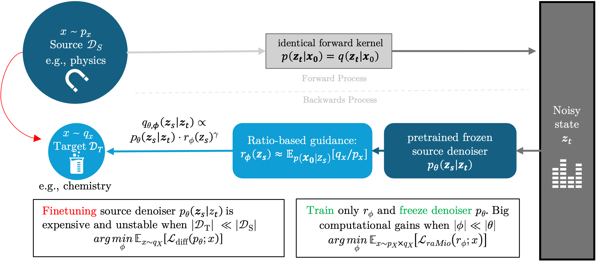

# Guided Transfer Learning for Discrete Diffusion Models
Julian Kleutgens, Claudio Battiloro, Lingkai Kong, Benjamin Grewe, Francesca Dominici, Mauricio Tec

This repository contains the code for the paper https://arxiv.org/abs/2512.10877

## Abstract 
Discrete diffusion models (DMs) have achieved strong performance in language and other discrete domains, offering a compelling alternative to autoregressive modeling. Yet this performance typically depends on large training datasets, challenging the performance of DMs in small-data regimes---common under real-world constraints. Aimed at this challenge, recent work in continuous DMs suggests that transfer learning via classifier ratio--based guidance can adapt a pretrained DM to a related target distribution, often outperforming alternatives such as full-weight fine-tuning on the target data. By contrast, transfer learning for discrete DMs remains  unexplored.
We address this gap by exploring practical analogues of ratio-based transfer learning for discrete DMs. Our theoretical analysis shows that a direct extension of existing ratio-based guidance is computationally prohibitive, scaling with vocabulary size. To overcome this limitation, we introduce a scheduling mechanism that yields a practical algorithm, **Guided Transfer Learning** for discrete diffusion models (GTL). GTL enables sampling from a target distribution without modifying the pretrained denoiser and reduces the cost to linear scaling in vocabulary size, which in turn supports longer sequence generation.
We evaluate GTL on sequential data, including synthetic Markov chains and language modeling tasks, and provide a detailed empirical analysis of its behavior. The results highlight a clear trade-off: when target datasets are large, weight fine-tuning is often preferable, whereas GTL becomes increasingly effective as target data shrinks. Finally, we experimentally demonstrate a key failure mode of GTL: when the source and target distributions overlap poorly, the ratio-based classifier required for guidance becomes unreliable, limiting transfer performance.

## Overview


Discrete diffusion models have shown strong performance in language and other discrete domains, but they usually require large training datasets. This repository studies transfer learning for discrete diffusion models in small-data regimes.

We introduce **Guided Transfer Learning (GTL)**, a method that adapts a pretrained source discrete diffusion model to a target domain **without fine-tuning the denoiser**. Instead, GTL uses a lightweight **ratio model** to guide sampling toward the target distribution. This makes transfer learning more stable and parameter-efficient when target data are scarce.

The paper includes:

- a theoretical derivation of ratio-guided reverse transitions for discrete diffusion
- an efficient guided sampler for masked discrete diffusion
- experiments on:
  - synthetic Markov chains (Section 4.1)
  - language modeling with arXiv abstracts (Section 4.2)

## Main Idea

Given:

- a **source distribution** with many samples
- a **target distribution** with few samples
- a pretrained **source denoiser**

GTL keeps the denoiser fixed and learns a **density-ratio estimator** between target and source. During sampling, this ratio reweights the source reverse process so that generated samples match the target domain.

This avoids updating millions of denoiser parameters and is especially useful in the low-data setting.

## Repository Structure

The repository is organized into two main components corresponding to the experiments in the paper:

- **synthetic-dataset/**  
  Contains the experiments from Section 4.1 (synthetic Markov chains).  
  This setup is lightweight and can be run locally on a CPU. It provides a simple and fast way to understand and test the proposed method.

- **discrete-language-diffusion/**  
  Contains the code for the language modeling experiments using masked discrete diffusion.  
  This module includes the implementation of the proposed guided sampling algorithm, enabling transfer learning for large-vocabulary sequence generation.

```text
Guided-Transfer-Learning-for-Discrete-Diffusion-Models/
├── README.md
├── .gitignore
├── synthetic-dataset/
└── discrete-language-diffusion/

