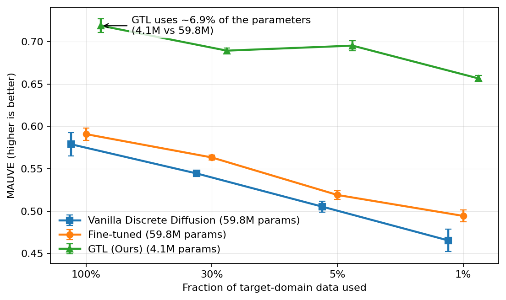

# Guided Transfer Learning for Discrete Language Models 

## Overview

GTL freezes a pretrained source denoiser and trains a small ratio estimator on mixed source/target data. At sampling time, the ratio network guides the reverse transitions toward the target distribution — no fine-tuning of the denoiser required.

**Key results:** GTL outperforms both vanilla and fine-tuned discrete diffusion across data-scarce regimes, while training only ~7% as many parameters.



---

### Model Files

| File | Class | Role |
|---|---|---|
| `diffusion.py` | `Diffusion` | Source denoiser $p_\theta$. Trained on source data with the masked diffusion objective. Frozen during GTL. Also implements the guided denoising algorithm at sampling time: combines the frozen denoiser logits with ratio network scores, applies top-$n_\text{ratio}$ pruning, mask-probability stabilization, and planner-selected position sampling (Algorithm 1 in the paper). |
| `classifier.py` | `Classifier` | Domain classifier $d_\omega$. Trained with binary labels (source=1, target=0). Provides pseudo-ratio targets for the ratio network. Supports both time-independent and time-dependent variants. |
| `ratio.py` | `RatioEstimator` | Ratio network $r_\phi(x_t, t)$. Trained with a guidance loss (against the frozen classifier) and a cycle-consistency loss on target data. Core component of GTL at sampling time. |
| `planner.py` | `Planner` | Planner network $\rho_\vartheta$. Predicts which masked position to unmask next. Reduces per-step ratio evaluations from $\mathcal{O}(L \|\mathcal{V}\|)$ to $\mathcal{O}(n_\text{ratio})$. |
| `noise_schedule.py` | `LogLinearNoise`, etc. | Noise schedules (log-linear, cosine, geometric, linear). Shared across all models. |
| `base_dm_model.py` | `BaseDMModel` | Abstract parent — corruption helpers, time sampling, checkpointing, dataloader hooks. |
| `dataloader.py` | — | Fault-tolerant samplers and dataset utilities. |

### Training Order
```
1. Train Source Denoiser (diffusion.py)   — freeze after training
2. Train Classifier     (classifier.py)   — time-independent + time-dependent
3. Train Ratio Estimator (ratio.py)       — uses frozen classifier + denoiser
4. Train Planner        (planner.py)      — uses frozen denoiser for labels
5. Sample               (diffusion.py)    — guided by ratio + planner
```

## Modes

All experiments are launched via `main.py` by setting `cfg.mode`. The table below maps each mode to its role in the GTL pipeline.

| `cfg.mode` | Description |
|---|---|
| `train` | Train the source denoiser $p_\theta$ on source-domain data using the masked diffusion objective. Run this first. |
| `train_ratio` | Run the full ratio training pipeline: trains the time-independent classifier, time-dependent classifier, and ratio estimator $r_\phi$ in sequence. Requires a pretrained denoiser. |
| `train_planner` | Train the planner network $\rho_\vartheta$ using the frozen source denoiser to generate binary correctness labels over masked positions. |
| `sample_eval` | Generate samples using ancestral guided sampling (ratio + denoiser, no planner). Evaluates with MAUVE and domain classifier score. |
| `sample_planner_eval` | Generate samples using planner-guided sampling, where the planner selects one position per step, reducing complexity to $\mathcal{O}(n_\text{ratio})$ per step. |
| `ppl_eval` | Evaluate generative perplexity (Gen. PPL) of generated samples using an external language model. |
| `full_evaluation` | Runs `sample_eval` followed by `ppl_eval` in one go — full end-to-end evaluation. |


---

## Dataset

We use the [arXiv abstracts dataset](https://www.kaggle.com/datasets/Cornell-University/arxiv), tokenized with `bert-base-uncased` (vocab size $N = 30{,}522$) into segments of 512 tokens.

| Domain | Samples |
|---|---|
| Computer Science | 285,946 |
| Mathematics | 176,831 |
| Physics (target) | 79,631 |

The source domain is CS ∪ Math (+ an optional fraction $r$ of Physics). The target domain is the remaining Physics abstracts.

---

## Environment Setup

**Step 1 — Create the environment**
```bash
mamba create -p /your/path/gtl_env python=3.9 pip
eval "$(conda shell.bash hook)"
conda activate /your/path/gtl_env
```

**Step 2 — Install PyTorch and core scientific packages**
```bash
mamba install -y -c conda-forge -c nvidia -c pytorch \
      pytorch=2.2.2 torchvision=0.17.2 pytorch-cuda=12.1 \
      jupyterlab git-lfs pandas=2.2 seaborn=0.13 scikit-learn=1.4

mamba install "numpy<2.0"
```

**Step 3 — Install remaining dependencies**
```bash
pip install datasets==2.18.0 einops==0.7.0 fsspec==2024.2.0 \
            h5py==3.10.0 hydra-core==1.3.2 ipdb==0.13.13 \
            lightning==2.2.1 nvitop==1.3.2 omegaconf==2.3.0 \
            packaging==23.2 rich==13.7.1 timm==0.9.16 \
            transformers==4.38.2 wandb==0.13.5

pip install -U sentencepiece tokenizers accelerate safetensors
```

**Activating an existing environment**
```bash
set +u
eval "$(conda shell.bash hook)"
mamba activate /your/path/gtl_env
set -u
```

---
