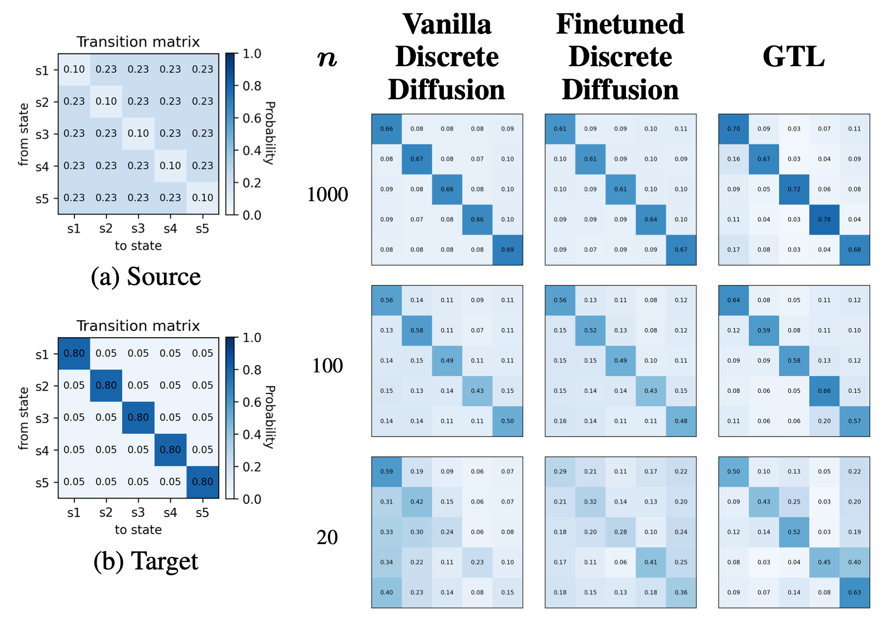

# Synthetic Dataset Experiments
This folder contains a lightweight implementation of the experiments described in **Section 4.1 (Synthetic Dataset)** of the paper.

The goal of this module is to provide a simple and fast environment to validate the proposed method before moving to large-scale language modeling.

## Purpose

The synthetic setup is designed to:

- demonstrate that **Guided Transfer Learning (GTL)** works in a controlled setting  
- compare GTL against standard baselines  
- provide an interpretable example where behavior can be directly analyzed  

All experiments can be run efficiently on a CPU.

---

## Data

We evaluate the method on three types of synthetic data:

- **Gaussian:** A discretized Gaussian mixture setting used to reproduce prior continuous transfer-learning results and illustrate how guidance strength controls the shift from source to target distribution.
- **Discrete Distribution:** A simple 2D discrete grid experiment that shows how well the method recovers a target distribution as the number of target samples decreases.
- **Markov Chain:** *(main setting)* A sequence-based setup with different transition matrices for source and target domains, used as the main experiment to demonstrate robustness and compare against fine-tuning and vanilla diffusion.
---

## Experiments

### 1. Main experiment (`main.py`)

This script demonstrates that the method works.

It:

- trains a source diffusion model  
- trains the ratio model  
- applies guided sampling  
- evaluates how well the generated samples match the target distribution  

This is the **simplest entry point** and recommended first run.

---

### 2. Method comparison (`main_comparison_methods.py`)

This script compares:

- **Vanilla diffusion** (trained only on target data)  
- **Fine-tuned diffusion** (source model adapted to target)  
- **Guided Transfer Learning (GTL)**  

The goal is to show that:

- GTL performs better in **low-data regimes**  
- GTL is more stable than fine-tuning  

---

## Key Implementation Detail

The core of the method is implemented in:

```text
diffusion.py
